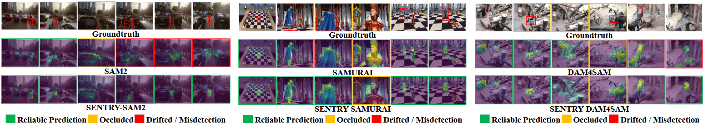
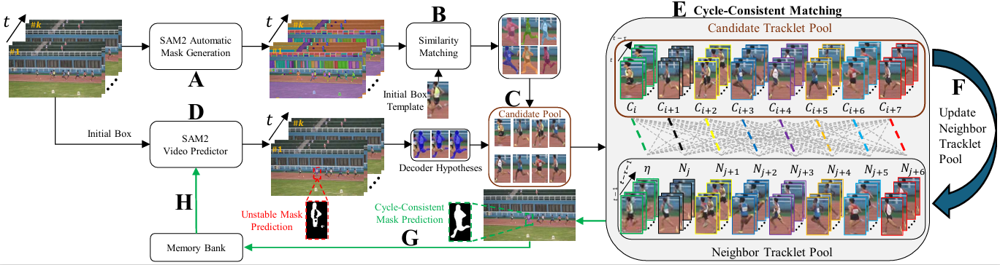

# SENTRY: SAM2-Enhanced Neighbor-Aware and Temporally Reasoned Memory for Visual Tracking

<!--
<p align="center">
  <a href="https://arxiv.org/abs/XXXX.XXXXX"></a>
  <a href="https://hamadya.github.io/SENTRY/"></a>
  <a href="https://github.com/<ORG>/SENTRY"></a>
</p>
-->

<p align="center">
  <a href="#">Paper</a>&nbsp;&nbsp;|&nbsp;&nbsp;
  <a href="https://hamadya.github.io/SENTRY/">Project Page</a>&nbsp;&nbsp;|&nbsp;&nbsp;
  <a href="#checkpoints">Checkpoints</a>&nbsp;&nbsp;|&nbsp;&nbsp;
  <a href="#evaluation">Evaluation</a>
</p>

**Official repository for "SENTRY: SAM2-Enhanced Neighbor-Aware and Temporally Reasoned Memory for Visual Tracking" (ECCV 2026).**

**Authors:** Mohamad Alansari*, Yonathan Michael*, Hasan AlMarzouqi, Muzammal Naseer, Naoufel Werghi, and Sajid Javed

Khalifa University, Abu Dhabi, UAE; University of Western Australia, Australia. *Equal contribution.

---

## Table of Contents
- [News](#news)
- [Introduction](#introduction)
- [Method Overview](#method-overview)
- [Model Lineup](#model-lineup)
- [Getting Started](#getting-started)
- [Checkpoints](#checkpoints)
- [Quick Run](#quick-run)
- [Training](#training)
- [Evaluation](#evaluation)
- [Citation](#citation)
- [Acknowledgements](#acknowledgements)

---

## News
- 2026-XX-XX: SENTRY has been accepted to ECCV 2026.
- 2026-XX-XX: Project page is available at https://hamadya.github.io/SENTRY/.
- 2026-XX-XX: Code, inference scripts, and evaluation wrappers will be released here.

### Release Plan and Checklist

We are releasing SENTRY code, configs, and evaluation scripts. Track progress here:

<details>
  <summary><b>View checklist</b></summary>

#### 1) Code and Inference
- [ ] Release SENTRY code.
- [ ] Add single-video tracking demo.
- [ ] Add examples for SENTRY-S2, SENTRY-SR, and SENTRY-D4S.
- [ ] Add visualization scripts for masks, boxes, and tracklets.

#### 2) Checkpoints and Third-Party Trackers
- [ ] Add SAM2 checkpoint preparation guide.
- [ ] Add SAMURAI integration instructions.
- [ ] Add DAM4SAM integration instructions.
- [ ] Add optional SAMITE and HiM2SAM integration notes.

#### 3) Evaluation
- [ ] Add benchmark preparation instructions.
- [ ] Add evaluation scripts for LaSOT, LaSOText, TNL2K, GOT-10k, and TrackingNet.
- [ ] Add evaluation scripts for VOT20, VOT22, VOTS24, and DiDi.
- [ ] Add scripts for VOS evaluation under the first-frame-mask protocol.

</details>

---

## Introduction

**SENTRY** is a training-free, plug-and-play memory-admission module for SAM2-based visual object tracking. It addresses a key failure mode in SAM2-style trackers: confidence-only mask selection can write incorrect masks into memory during occlusion, abrupt motion, or distractor interference, causing drift in later frames.

<p align="center">
  
</p>

Instead of committing the highest-confidence mask directly to memory, SENTRY performs **refine-before-write** validation. It aggregates multiple candidate masks, backtracks them into short tracklets, compares them against recent target and neighbor trajectories, and writes only the most temporally consistent mask to memory.

Key properties:

- **Training-free:** no retraining or finetuning is required.
- **Plug-and-play:** integrates with existing SAM2-based trackers.
- **Memory-safe:** validates masks before writing them into the autoregressive memory stream.
- **Neighbor-aware:** penalizes candidates that align with nearby distractors.
- **Real-time:** large-model SENTRY variants remain real-time on an NVIDIA A100.

---

## Method Overview

<p align="center">
  
</p>

SENTRY operates at the memory-write interface of a host tracker.

### 1. Candidate Mask Generation

For each frame, SENTRY builds a compact candidate pool from:

- SAM2 decoder hypotheses.
- Automatic Mask Generation (AMG) proposals.
- Soft-NMS filtered candidates for spatial diversity.
- A Kalman motion-prior fallback for severe occlusion or unreliable appearance.

### 2. Short-Horizon Temporal Reasoning

Each candidate is backtracked over a fixed temporal window to produce a candidate tracklet. SENTRY compares these tracklets with:

- the recent target trajectory, and
- neighbor tracklets representing distractors or non-selected candidates.

### 3. Cycle-Consistent Memory Admission

SENTRY selects the candidate whose backward-propagated trajectory is most consistent with the target trajectory while avoiding neighbor/distractor trajectories. The selected mask is then written to memory using the host tracker's default update schedule.

---

## Model Lineup

SENTRY can be attached to multiple SAM2-based visual trackers.

| SENTRY variant | Host tracker | Description |
| :--- | :--- | :--- |
| **SENTRY-S2** | SAM2 | SENTRY applied to vanilla SAM2. |
| **SENTRY-SR** | SAMURAI | SENTRY applied to SAMURAI motion-aware memory. |
| **SENTRY-D4S** | DAM4SAM | SENTRY applied to DAM4SAM distractor-aware memory. |
| **SENTRY-SA** | SAMITE | Optional extended evaluation host. |
| **SENTRY-HiM** | HiM2SAM | Optional extended evaluation host. |

Supported SAM2 model scales:

| Scale | Name |
| :--- | :--- |
| T | Tiny |
| S | Small |
| B | Base |
| L | Large |

---

## Getting Started

### Environment Setup

Clone the repository:

```bash
git clone https://github.com/<ORG>/SENTRY.git
cd SENTRY
```

Create the environment:

```bash
conda env create -f environment.yml
conda activate sentry
```

Fallback manual installation:

```bash
conda create -n sentry python=3.10 -y
conda activate sentry
pip install --upgrade pip
pip install -r requirements.txt
```

A typical setup requires PyTorch, SAM2, OpenCV, NumPy, SciPy, tqdm, matplotlib, pycocotools, and the official benchmark toolkits for evaluation.

---

## Checkpoints

Place host tracker checkpoints under `checkpoints/`.

Expected directory structure:

```bash
SENTRY/
├── checkpoints/
│   ├── sam2/
│   │   ├── sam2_hiera_tiny.pt
│   │   ├── sam2_hiera_small.pt
│   │   ├── sam2_hiera_base_plus.pt
│   │   └── sam2_hiera_large.pt
│   ├── samurai/
│   ├── dam4sam/
│   ├── samite/
│   └── him2sam/
├── configs/
├── tools/
├── scripts/
├── assets/
└── outputs/
```

Recommended checkpoint sources:

| Component | Source | Destination |
| :--- | :--- | :--- |
| SAM2 | Official SAM2 checkpoints | `checkpoints/sam2/` |
| SAMURAI | Official SAMURAI release | `checkpoints/samurai/` |
| DAM4SAM | Official DAM4SAM release | `checkpoints/dam4sam/` |
| SAMITE | Official SAMITE release, optional | `checkpoints/samite/` |
| HiM2SAM | Official HiM2SAM release, optional | `checkpoints/him2sam/` |

---

## Quick Run

The following example assumes the repository exposes `tools/demo.py`. Update script names if your local release uses a different layout.

### Run SENTRY-S2 on a video

```bash
python tools/demo.py \
  --tracker sentry_s2 \
  --model-size large \
  --video-path assets/example_video.mp4 \
  --init-bbox 320 180 80 120 \
  --save-dir outputs/sentry_s2_demo
```

### Run SENTRY-D4S on a video

```bash
python tools/demo.py \
  --tracker sentry_d4s \
  --model-size large \
  --video-path assets/example_video.mp4 \
  --init-bbox 320 180 80 120 \
  --save-dir outputs/sentry_d4s_demo
```

Arguments:

- `--tracker`: choose `sentry_s2`, `sentry_sr`, or `sentry_d4s`.
- `--model-size`: choose `tiny`, `small`, `base`, or `large`.
- `--video-path`: path to an input video.
- `--init-bbox`: first-frame target box in `x y w h` format.
- `--init-mask`: optional first-frame target mask.
- `--save-dir`: directory for boxes, masks, and visualizations.

---

<a id="training"></a>
## Training

SENTRY is **training-free**. No SENTRY-specific finetuning is required.

To reproduce the paper results, download the host tracker checkpoints and run SENTRY at inference time. SENTRY changes the memory-admission decision before memory writing, while leaving the host backbone, decoder, and memory architecture unchanged.

---

<a id="evaluation"></a>
## Evaluation

SENTRY is evaluated on bounding-box tracking, VOT-style tracking, and VOS benchmarks.

### Bounding-Box Tracking

Datasets:

- LaSOT
- LaSOText
- TNL2K
- GOT-10k
- TrackingNet

Example command:

```bash
python tools/eval.py \
  --tracker sentry_d4s \
  --model-size large \
  --dataset LaSOT \
  --data-root /path/to/LaSOT \
  --save-dir outputs/eval/lasot_sentry_d4s_l
```

### VOT-Style Tracking

Datasets:

- VOT20
- VOT22
- VOTS24
- DiDi

Example command:

```bash
python tools/eval_vot.py \
  --tracker sentry_d4s \
  --model-size large \
  --dataset VOT22 \
  --data-root /path/to/VOT22 \
  --save-dir outputs/eval/vot22_sentry_d4s_l
```

### Main Results: Large Models

Bounding-box benchmarks:

| Method | LaSOT S | LaSOText S | TNL2K S | GOT-10k AO | TrackingNet S |
| :--- | ---: | ---: | ---: | ---: | ---: |
| SAM2-L | 68.5 | 56.8 | 56.7 | 80.8 | 85.3 |
| SENTRY-S2-L | 70.2 | 57.0 | 57.9 | 81.1 | 85.7 |
| SAMURAI-L | 74.2 | 61.0 | 50.6 | 81.7 | 85.3 |
| SENTRY-SR-L | 75.1 | 61.5 | 59.6 | 81.8 | 85.8 |
| DAM4SAM-L | 75.1 | 60.9 | 59.8 | 81.1 | 85.3 |
| SENTRY-D4S-L | **76.3** | **61.8** | **61.3** | **82.1** | **85.9** |

VOT-style benchmarks:

| Method | VOT20 Q | VOT22 Q | VOTS24 Q | DiDi Q |
| :--- | ---: | ---: | ---: | ---: |
| SAM2-L | 0.681 | 0.692 | 0.661 | 0.649 |
| SENTRY-S2-L | 0.690 | 0.701 | 0.669 | 0.660 |
| SAMURAI-L | 0.674 | 0.693 | 0.673 | 0.680 |
| SENTRY-SR-L | 0.686 | 0.715 | 0.681 | 0.693 |
| DAM4SAM-L | 0.723 | 0.750 | 0.711 | 0.694 |
| SENTRY-D4S-L | **0.732** | **0.759** | **0.715** | **0.705** |

Runtime on NVIDIA A100:

| Method | Base FPS | SENTRY FPS | FPS drop | Base VRAM | SENTRY VRAM |
| :--- | ---: | ---: | ---: | ---: | ---: |
| SAM2-L -> SENTRY-S2-L | 44.0 | 32.8 | 25.5% | 5.1 GB | 5.7 GB |
| SAMURAI-L -> SENTRY-SR-L | 40.6 | 30.9 | 24.0% | 5.2 GB | 5.7 GB |
| DAM4SAM-L -> SENTRY-D4S-L | 39.4 | 30.2 | 23.4% | 5.2 GB | 5.7 GB |

---

## Citation

If you find SENTRY useful in your research, please consider citing our paper:

```bibtex
@inproceedings{alansari2026sentry,
  title={SENTRY: SAM2-Enhanced Neighbor-Aware and Temporally Reasoned Memory for Visual Tracking},
  author={Alansari, Mohamad and Michael, Yonathan and AlMarzouqi, Hasan and Naseer, Muzammal and Werghi, Naoufel and Javed, Sajid},
  booktitle={Proceedings of the European Conference on Computer Vision (ECCV)},
  year={2026}
}
```

---

## Acknowledgements

This work was supported in part by the Khalifa University Center for Autonomous Robotic Systems (KUCARS) under Award RC1-2018-KUCARS; in part by Silal Innovation Oasis through projects under grants 8475000023, 8475000024, 8475000025, and 8475000026; and in part by Khalifa University of Science and Technology through the Faculty Start-Ups under Project ID KU-INT-FSU-2005-8474000775.

---

## License

Please check the license terms of this repository and the third-party projects used by SENTRY, including SAM2, SAMURAI, DAM4SAM, SAMITE, and HiM2SAM.

